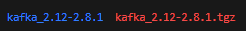
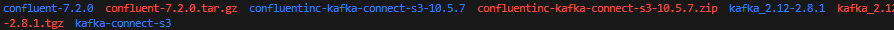
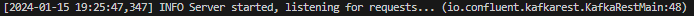
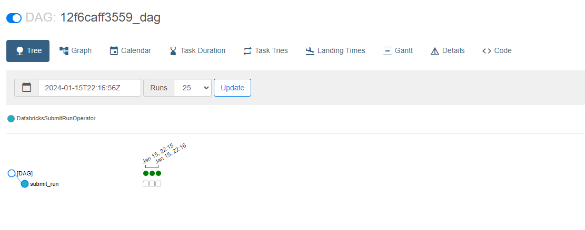
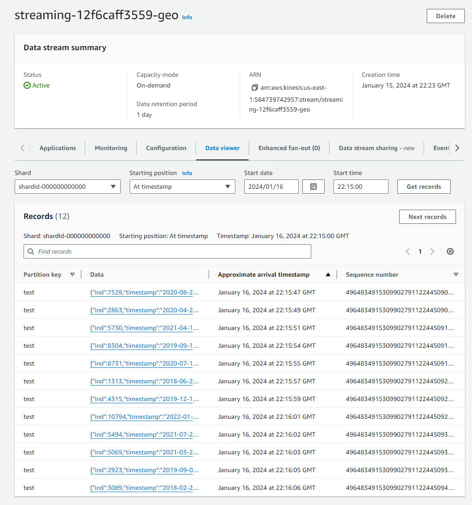

# Pinterest Data Pipeline

## Table of Contents
- [Project Description](#project-description)
- [Skills Developed](#skills-developed)
- [Project Development](#project-development)
  - [Milestone 1: Setting up the Environment](#milestone-1-setting-up-the-environment)
  - [Milestone 2: Getting Started](#milestone-2-getting-started)
  - [Milestone 3: Batch Processing - Configuring EC2 Kafka Client](#milestone-3-batch-processing---configuring-ec2-kafka-client)
  - [Milestone 4: Batch Processing - Connecting an MSK Cluster to S3 Bucket](#milestone-4-batch-processing---connecting-an-msk-cluster-to-s3-bucket)
  - [Milestone 5: Batch Processing - Configuring an API in API Gateway](#milestone-5-batch-processing---configuring-an-api-in-api-gateway)
  - [Milestone 6: Batch Processing - Databricks Setup](#milestone-6-batch-processing---databricks-setup)
  - [Milestone 7: Batch Processing - Spark on Databricks](#milestone-7-batch-processing---spark-on-databricks)
  - [Milestone 8: Batch Processing - AWS MWAA (Airflow)](#milestone-8-batch-processing---aws-mwaa-airflow)

## Project Description

In this project, I have built a date pipeline for Pinterest, a business that analyzes billions of data points daily to enhance user experience, using the capabilities of the AWS cloud.

## Skills developed

- **AWS Connectivity and Navigation:** Mastery in establishing connections and navigating the AWS ecosystem.
- **EC2 Configuration for Apache Kafka:** Expertise in configuring an Amazon EC2 instance to serve as an Apache Kafka client machine.
- **EC2 Kafka Client Management:** Proficiency in managing and configuring the EC2 Kafka client.
- **MSK Cluster and S3 Integration:** Skills in linking an MSK cluster with an Amazon S3 bucket for seamless data processing and storage.

## Project Development

### Milestone 1: Seting up the environment
- Set up the GitHub enviornment.
- Set up the AWS account with credentials.
### Milestone 2: Getting Started
- Downloaded user_posting_emulation.py which contained login credentials for an RDS database as well as a script to receive pinterest data (post, geographic, user)
- Signed in to and finished setting up the AWS Console. 
### Milestone 3: Batch Processing: Configuring EC2 Kafka Client
- 12f6caff3559-key-pair.pem file created locally to connect to the EC2 instance (.gitignored)
- Connected to EC2 instance using ssh, the command is provided within the management console.

--
- Installed and Unpacked Kafka 2.12-2.8.81 on EC2 instance.

--
- Installed and set up the IAM MSK authentication package on EC2 Client (within lib folder of kafka)
- Edited trust policy on IAM console for my assigned ec2 role
- Edited client.properties file (inside /bin/ folder of kafka) accordingly
- Created three Kafka Topics using bootstrap string from the EC2 details on the console: 12f6caff3559.pin, 12f6caff3559.geo, 12f6caff3559.user. One for each data type to be extracted from the RDS.

--

### Milestone 4: Batch Processing: Connecting an MSK Cluster to S3 Bucket
- Downloaded Confluent.io Amazon S3 Connector to the S3 Bucket via the EC2 Client.
- Created new MSK Plugin using the zip file in the object.
- Created a new connector using the plugin with correct configurations and appropriate set-up.

--

### Milestone 5: Batch Processing: Configuring an API in API Gateway
- Created a resource that allowed a PROXY integration for the API.
- Created a HTTP ANY method. Endpoint URL was pulled from the EC2 Public DNS. 
- Deployed API while saving the Invoke URL to the side. 

--
- Installed Confluent Package for Kafka Rest on EC2 Client.

--
-  Edited kafka-rest.properties file to allow for IAM authentication, similarly to what was done prior.
- Started the REST Proxy. (It should say "Listening for requests. . .')

--
- Configured **user_posting_emulation.py** as **user_posting_emulation_batches.py** to send data via the API and test.
- I made the script print the status code to allow me to see if any issues arose with the API connection.
- Once the topics and files showed within my S3, I knew that i had set it up correctly.

--

## *Please inside check the *Databricks* folder for scripts for Milestone 6/7/9 Notebooks/Scripts*
### Milestone 6: Batch Processing: Databricks Setup
- Created and set up my Databricks account.
- Mounted my S3 Bucket onto Databricks using the Access Key and Secret Access key provided within the 
- Created 3 dataframes, one for each of the topics: df_pin, df_geo and df_user.

### Milestone 7: Batch Processing: Spark on Databricks
- Using the scripts within the notebook file in the Databricks Notebooks folder, I was able to clean all three of the Dataframes on Databricks.
- Cleaning involved changing column names, column casting, re-ordering columns and removing empty or wrong values.
- I then ran different scripts utilising SparkSQL to retrieve tables that would provide insight on the data, such as the most popular category in each country or the user with the most followers in a given country. 
### Milestone 8: Batch Processing: AWS MWAA (Airflow)
- I created a DAG that would schedule the notebook at daily frequency using AWS MWAA. I wrote the dag file (.py) on Visual Studio.
- I ran the DAG manually from Airflow and it was successful three times, I then initiate the daily schedule.

### Milestone 9: Stream Processing: AWS Kinesis
- I created three data streams within AWS Kinesis: *streaming-12f6caff3559-pin*,*streaming-12f6caff3559-user* and *streaming-12f6caff3559-geo*.
- I utilised the REST API made earlier and configured it to allow for Kinesis actions.
- Once the API was configured appropiately, I modified the emulator script to stream for streaming to kinesis and began testing.
- I could see that the emulator was successfuly connecting and streaming data to kinesis using the data viewer within the console.

 
- Similarly to the batch process (+ authentication), i cleaned and wrote the streamed data to databricks delta tables with the notebook scripts in the 'Databricks Notebooks' folder.

## Reflection 

Completing the Pinterest Data Pipeline project has been a great educational experience. Throughout these tasks, I've gained not only technical skills but also valuable insights into the complexities and of building a robust and scalable data pipeline in a real-world scenario.

