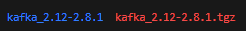
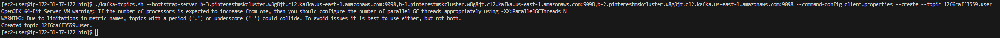
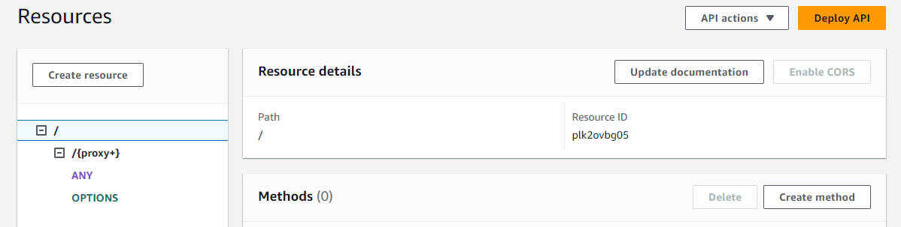
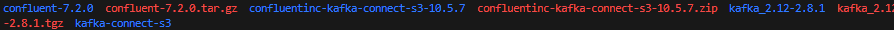
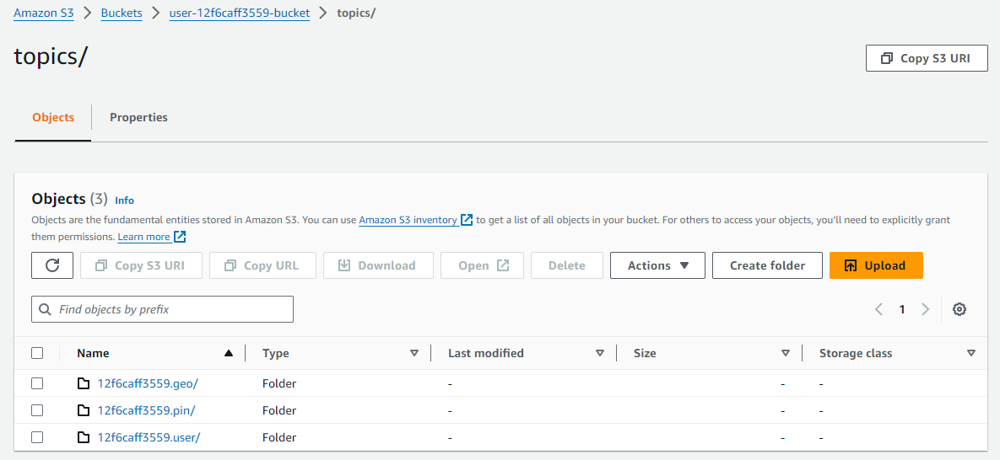
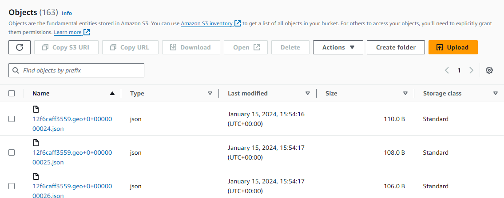

# Pinterest Data Pipeline

## Table of Contents (WIP)

## Project Description

In this project, I have built a date pipeline for Pinterest, a business that  analyzes billions of data points daily to enhance user experience, using the capabilities of the AWS cloud.

## Skills developed

- **AWS Connectivity and Navigation:** Mastery in establishing connections and navigating the AWS ecosystem.
- **EC2 Configuration for Apache Kafka:** Expertise in configuring an Amazon EC2 instance to serve as an Apache Kafka client machine.
- **EC2 Kafka Client Management:** Proficiency in managing and configuring the EC2 Kafka client.
- **MSK Cluster and S3 Integration:** Skills in linking an MSK cluster with an Amazon S3 bucket for seamless data processing and storage.

## Project Development

### Milestone 1: Seting up the environment
- Set up the GitHub enviornment.
- Set up the AWS account with credentials.
### Milestone 2: Getting Started
- Downloaded user_posting_emulation.py which contained login credentials for an RDS database as well as a script to receive pinterest data (post, geographic, user)
- Signed in to and finished setting up the AWS Console. 
### Milestone 3: Batch Processing: Configuring EC2 Kafka Client
- 12f6caff3559-key-pair.pem file created locally to connect to the EC2 instance (.gitignored)
- Connected to EC2 instance using ssh, the command is provided within the management console.

--
- Installed and Unpacked Kafka 2.12-2.8.81 on EC2 instance.

--
- Installed and set up the IAM MSK authentication package on EC2 Client (within lib folder of kafka)
- Edited trust policy on IAM console for my assigned ec2 role
- Edited client.properties file (inside /bin/ folder of kafka) accordingly
- Created three Kafka Topics using bootstrap string from the EC2 details on the console: 12f6caff3559.pin, 12f6caff3559.geo, 12f6caff3559.user. One for each data type to be extracted from the RDS.

--
- 
### Milestone 4: Batch Processing: Connecting an MSK Cluster to S3 Bucket
- Downloaded Confluent.io Amazon S3 Connector to the S3 Bucket via the EC2 Client.
- Created new MSK Plugin using the zip file in the object.
- Created a new connector using the plugin with correct configurations and appropriate set-up.

--
- 
### Milestone 5: Batch Processing: Configuring an API in API Gateway
- Created a resource that allowed a PROXY integration for the API.
- Created a HTTP ANY method. Endpoint URL was pulled from the EC2 Public DNS. 
- Deployed API while saving the Invoke URL to the side. 

--
- Installed Confluent Package for Kafka Rest on EC2 Client.

--
-  Edited kafka-rest.properties file to allow for IAM authentication, similarly to what was done prior.
- Started the REST Proxy. (It should say "Listening for requests. . .')

--
- Configured **user_posting_emulation.py** as **user_posting_emulation_batches.py** to send data via the API and test.
- I made the script print the status code to allow me to see if any issues arose with the API connection.
- Once the topics and files showed within my S3, I knew that i had set it up correctly.

--
- 
### Milestone 6: Batch Processing: Databricks Setup
- Created and set up my Databricks account.
- Mounted my S3 Bucket onto Databriks using the Acess Key and Secret Access key provided within the 
- Created 3 dataframes, one for each of the topics: df_pin, df_geo and df_user.
- 
### Milestone 7: Batch Processing: Spark on Databricks
### Milestone 8: Batch Processing: AWS MWAA (Airflow)
### Milestone 9: Stream Processing: AWS Kinesis

