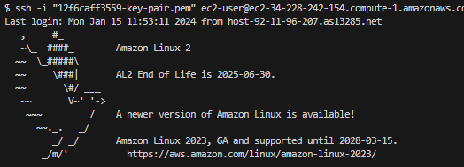

# Pinterest Data Pipeline

## Table of Contents (WIP)

## Project Description

In this project, I have built a date pipeline for Pinterest, a business that  analyzes billions of data points daily to enhance user experience, using the capabilities of the AWS cloud.

## Skills developed

- **AWS Connectivity and Navigation:** Mastery in establishing connections and navigating the AWS ecosystem.
- **EC2 Configuration for Apache Kafka:** Expertise in configuring an Amazon EC2 instance to serve as an Apache Kafka client machine.
- **EC2 Kafka Client Management:** Proficiency in managing and configuring the EC2 Kafka client.
- **MSK Cluster and S3 Integration:** Skills in linking an MSK cluster with an Amazon S3 bucket for seamless data processing and storage.

## Project Development

### Milestone 1: Seting up the environment
- Set up the GitHub enviornment.
- Set up the AWS account with credentials.
### Milestone 2: Getting Started
- Downloaded user_posting_emulation.py which contained login credentials for an RDS database as well as a script to receive pinterest data (post, geographic, user)
- Signed in to and finished setting up the AWS Console. 
### Milestone 3: Batch Processing: Configuring EC2 Kafka Client
- 12f6caff3559-key-pair.pem file created locally to connect to the EC2 instance (.gitignored)
- Connected to EC2 instance using ssh, the command is provided within the management console.
#

--
- Installed Kafka on EC2 
### Milestone 4: Batch Processing: Connecting an MSK Cluster to S3 Bucket
### Milestone 5: Batch Processing: Configuring an API in API Gateway
### Milestone 6: Batch Processing: Databricks Setup
### Milestone 7: Batch Processing: Spark on Databricks
### Milestone 8: Batch Processing: AWS MWAA (Airflow)
### Milestone 9: Stream Processing: AWS Kinesis

